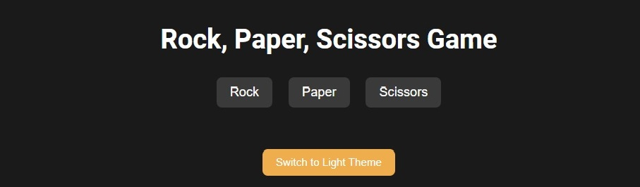

# Rock Paper Scissors Game

### Created by Dustin Moore

## Description
This is a simple yet fully functional Rock, Paper, Scissors game that can be played on both desktop and mobile devices. The game includes:
- A responsive design that works seamlessly across devices.
- Dark/light theme toggle for a customizable user experience.
- A first-to-5 point system where the winner is declared.
- A restart button for multiple rounds of fun.

The project was built to sharpen my skills in JavaScript, HTML, and CSS, especially focusing on cross-device compatibility and event handling for touch screens.

## Features
- **Responsive Design**: Works on desktop, tablets, and mobile devices.
- **Cross-Device Compatibility**: Special attention was given to handling click and touch events for mobile users.
- **Dark/Light Mode**: Users can switch between dark and light themes.
- **Restart Button**: Allows players to restart the game once a winner is declared.

## Technologies Used
- HTML5
- CSS3
- JavaScript

## How to Play
1. Open the game in your browser.
2. Choose your move by clicking or tapping on either "Rock", "Paper", or "Scissors".
3. The computer will randomly select a move, and the result will be displayed on the screen.
4. The first player (you or the computer) to reach 5 points wins the game.
5. You can restart the game at any time by clicking the "Restart Game" button.

## Installation
To run this game locally:
1. Clone this repository to your local machine.
   ```
   git clone https://github.com/yourusername/rock-paper-scissors.git
   ```
2. Open the `index.html` file in your favorite browser.

## Screenshots


## Credits
This project was created by Dustin Moore. Special thanks to everyone who provided feedback and inspiration along the way.

## License
This project is licensed under the MIT License. See the `LICENSE` file for details.

## Feedback
Feel free to open an issue or create a pull request if you have any suggestions or improvements.

